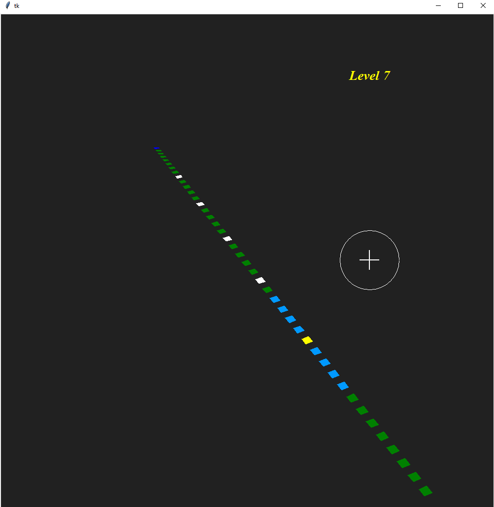

# The Twang 42 Game
A funny, simple and very additive game for the PC, based on Twang32 for the ESP32 that uses a LED strip.

# Description
This is the Twang 42 game. A very simple and partial re-implementation for the PC, of the game Twang32 for the ESP32 microcontroller that uses a LED strip and a joystick made with a door Twang spring. See the video of the original [TWANG32 LED Strip Game Demo](https://www.youtube.com/watch?v=RXpfa-ZvUMA) I wanted to make this game for my daughter and I didn't had a LED strip nor an accelerometer. So I made a simple PC version hack during two days of work. <br>
I wanted to make it in 3D, so that it retained the cool aspect of the perspective of the LED strip that you can see in the video. But I wanted to make something fast so my daughter could play soon. With that in mind I choose the Python programming Language for this project. For the 3D API I taught of PyOpenGL, PyGame and Pandas3D, but I have little, rusty, or no experience with those API's, so I asked around and a friend suggested that I used the TK API (Tkinter in Python). That is a GUI API that has a Canvas 2D Widget with functions to draw polygons and that I could implemented the mathematics of the projection of a 3D world in a 2D world using the draw polygons functions. I searched around on the internet and found a small example in Stack Overflow of a small example code that did that. But that had an error, and that was why the person has posted the code. [How to display tkinter polygons on canvas under 3D conditions?](https://stackoverflow.com/questions/54043171/how-to-display-tkinter-polygons-on-canvas-under-3d-conditions) <br>
I have corrected the error and I give the corrected file here [cube.py](./cube.py). This program draws a 3D cube inside TK API and makes it spin in different directions depending on the mouse position. It didn't draw the faces of the cube correctly, the version I give here is the some code but with the correction of the Z ordered drawing of the polygons and some very small addictions. <br>
Then I started with this and changed almost everything in the code except the math of the projections, I hacked away all the 3D graphic part until it was finished. Then I started on the game partial re-implementation ... I studied all the code, but rendering engine was really different and I wanted to implement a much simpler version (partial implementation), so I used an adaptation of the Enemy class from the original code and made my own custom version of all the rest. Following the game play that I had seen on the original Twang32 video. <br>

# Twang 42 screen shoot
 


# The history of Twang32 in which my re-implementation is based
From the file [TWANG32.ino](https://github.com/bdring/TWANG32/blob/master/TWANG32/TWANG32.ino) of the original github repository. <br>

```
TWANG32 - An ESP32 port of TWANG
(c) B. Dring 3/2018
License: Creative Commons 4.0 Attribution - Share Alike	
	
TWANG was originally created by Critters
https://github.com/Critters/TWANG
	
It was inspired by Robin Baumgarten's Line Wobbler GameTWANG32 - An ESP32 port of TWANG
(c) B. Dring 3/2018
License: Creative Commons 4.0 Attribution - Share Alike	
	
TWANG was originally created by Critters
https://github.com/Critters/TWANG
	
It was inspired by Robin Baumgarten's Line Wobbler Game
```

# How to run
The Twang 42 uses only Python, Tkinter (TK for Python, that comes with Python) and NumPy. <br>

```
python twang42.py 
```

# Instructions on how to play the game
* Currently the game has 8 levels that aren't a exactly what the first 8 levels of the original are, see the video of Twang32 in the references below. My version is much simpler.
* The game objective in each level is to reach the blue rectangle in the end of the line.
* The game is mainly controlled with the mouse, but also has some keys.  
* You can go forward and backward (accelerate) in the line by placing the mouse pointer upwards or downwards of the cross target in the screen. This was the most identical interface that I come up with to try to emulate the accelerometer door spring joystick of the original game. If you go outside the circle it doesn't do anything and stops the player.
* You have also an Attack move that you can make by going sideways with your mouse. In booth horizontal far sides, inside regions fo the circle. The Attack as a duration, and after that there is a period that you cannot attack.
* The game has the keys 'a', 'd', 's', 'w', to rotate the view of the game in the yy's and xx's axes.
* You also have the 'r' key to start recording and finishing recording the rotations, so that you can change the starting view angle of the game. You have to manually copy the rotation sequence list to the end of the game.

# References:
* [How to display tkinter polygons on canvas under 3D conditions?](https://stackoverflow.com/questions/54043171/how-to-display-tkinter-polygons-on-canvas-under-3d-conditions)
* [Youtube Video - TWANG32 LED Strip Game Demo](https://www.youtube.com/watch?v=RXpfa-ZvUMA)
* [buildlog.net on Twang32](http://www.buildlog.net/blog/?s=twang)
* [GitHub - bdring/TWANG32](https://github.com/bdring/TWANG32)

# License
 MIT Open Source License

# Have fun!
Best regards, <br>
Joao Nuno Carvalho <br>
